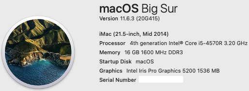

# Gigabyte-BXi5-4570R with Opencore 0.7.4
<p align="center">
  
 </p>
 <p align="center">
  
 </p>
   <p align="center">
  
 </p>

## Specs
| **Component** | **Model** |
| ------------- | --------- |
| CPU | i5-4570R 4 cores and 4 threads @ 3.2GHz |
| RAM | 2x8GB 1600MHz DDR3 SO-DIMM Kingston KVR16LS11/8 |
| Audio Chipset | Realtek ALC269. Works with Layout-id 10 |
| GPU | Intel Iris Pro Graphics 5200 |
| WiFi & Bluetooth | DW1550 (BCM94352HMB) Half-size mini-PCIe |
| Lan |  Gigabit LAN (Realtek RTL8111G) |
| OS Disk | 1TB Samsung mSATA T5 Portable |
| macOS | Big Sur 11.6.1/OpenCore 0.7.4

## BIOS
- Press F2 to enter the BIOS. Use latest available bios for this BRIX which is F7.
- SATA Mode AHCI
- XHCI Mode Smart Auto
- CFG-Lock Disabled
- Launch CSM Disabled

## Opencore
- Fill in your own PlatformInfo. For Big Sur use iMac14,4 SMBIOS.
- From Opencore boot screen go to modGRUBShell and set the values for DVMT Pre-Allocated and DVMT Total Gfx Mem to the following:
```
setup_var 0x30A 0x04
setup_var 0x30B 0x03
```
This will set DVMT Pre-Allocated to 128MB and DVMT Total Gfx Mem to MAX

Here is bios table section extracted with UEFITool:
```
0x36790 		One Of: DVMT Pre-Allocated, VarStoreInfo (VarOffset/VarName): 0x30A, VarStore: 0x1, QuestionId: 0x262, Size: 1, Min: 0x0, Max 0x0, Step: 0x0 {05 A6 BF 04 D1 04 62 02 01 00 0A 03 10 10 00 00 00 00 00 00 00 00 00 00 00 00 00 00 00 00 00 00 00 00 00 00 00 00}
0x367B6 			One Of Option: 32M, Value (8 bit): 0x1 (default) {09 0E C0 04 30 00 01 00 00 00 00 00 00 00}
0x367C4 			One Of Option: 64M, Value (8 bit): 0x2 {09 0E C1 04 00 00 02 00 00 00 00 00 00 00}
0x367D2 			One Of Option: 96M, Value (8 bit): 0x3 {09 0E C2 04 00 00 03 00 00 00 00 00 00 00}
0x367E0 			One Of Option: 128M, Value (8 bit): 0x4 {09 0E C3 04 00 00 04 00 00 00 00 00 00 00}
0x367EE 			One Of Option: 160M, Value (8 bit): 0x5 {09 0E C4 04 00 00 05 00 00 00 00 00 00 00}
0x367FC 			One Of Option: 192M, Value (8 bit): 0x6 {09 0E C5 04 00 00 06 00 00 00 00 00 00 00}
0x3680A 			One Of Option: 224M, Value (8 bit): 0x7 {09 0E C6 04 00 00 07 00 00 00 00 00 00 00}
0x36818 			One Of Option: 256M, Value (8 bit): 0x8 {09 0E C7 04 00 00 08 00 00 00 00 00 00 00}
0x36826 			One Of Option: 288M, Value (8 bit): 0x9 {09 0E C8 04 00 00 09 00 00 00 00 00 00 00}
0x36834 			One Of Option: 320M, Value (8 bit): 0xA {09 0E C9 04 00 00 0A 00 00 00 00 00 00 00}
0x36842 			One Of Option: 352M, Value (8 bit): 0xB {09 0E CA 04 00 00 0B 00 00 00 00 00 00 00}
0x36850 			One Of Option: 384M, Value (8 bit): 0xC {09 0E CB 04 00 00 0C 00 00 00 00 00 00 00}
0x3685E 			One Of Option: 416M, Value (8 bit): 0xD {09 0E CC 04 00 00 0D 00 00 00 00 00 00 00}
0x3686C 			One Of Option: 448M, Value (8 bit): 0xE {09 0E CD 04 00 00 0E 00 00 00 00 00 00 00}
0x3687A 			One Of Option: 480M, Value (8 bit): 0xF {09 0E CE 04 00 00 0F 00 00 00 00 00 00 00}
0x36888 			One Of Option: 512M, Value (8 bit): 0x10 {09 0E CF 04 00 00 10 00 00 00 00 00 00 00}
0x36896 			One Of Option: 1024M, Value (8 bit): 0x11 {09 0E D0 04 00 00 11 00 00 00 00 00 00 00}
0x368A4 		End One Of {29 02}
0x368A6 		One Of: DVMT Total Gfx Mem, VarStoreInfo (VarOffset/VarName): 0x30B, VarStore: 0x1, QuestionId: 0x263, Size: 1, Min: 0x0, Max 0x0, Step: 0x0 {05 A6 D2 04 D3 04 63 02 01 00 0B 03 10 10 00 00 00 00 00 00 00 00 00 00 00 00 00 00 00 00 00 00 00 00 00 00 00 00}
0x368CC 			One Of Option: 128M, Value (8 bit): 0x1 {09 0E D4 04 00 00 01 00 00 00 00 00 00 00}
0x368DA 			One Of Option: 256M, Value (8 bit): 0x2 (default) {09 0E D5 04 30 00 02 00 00 00 00 00 00 00}
0x368E8 			One Of Option: MAX, Value (8 bit): 0x3 {09 0E D6 04 00 00 03 00 00 00 00 00 00 00}
0x368F6 		End One Of {29 02}
```
## What is working
Everything is working. LAN, WIFI and Bluetooth all work. I have created custom USBMap.kext, so all USB ports are working.
Since WiFi module is not native to macOS and requires kexts to work properly, bluetooth keyboard/mouse would not work in the bios. Use wired ones.
Audio is working with Layout-ID 10. Headphone jack is working. HDMI audio is also working.
Both HDMI and mDP ports work. I'm using dual monitor setup. There is an issue with 4k resolution. Out of the box it does not show up as an option. I had to tinker with the system to get it working. Working on a 4k resolution is not pleasant as things are too small on the screen. So I default to 2560x1440 at 60Hz.
Facetime and iMessage both work fine. Hand-off also works.

## What is not working
As this is iGPU only system, DRM protected content is not working as per [Fixing DRM support][1].
AppleTV+ is not working therefore. Netflix is ok through Chrome browser.

[1]:https://dortania.github.io/OpenCore-Post-Install/universal/drm.html#fixing-drm-support-and-igpu-performance
